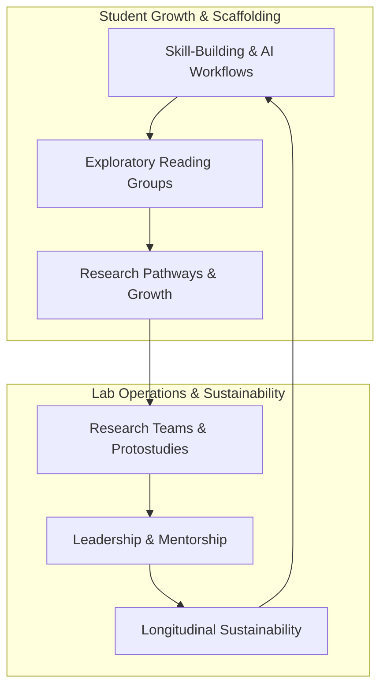

# Product Definition Chat Log — Calibrated AI Coding Mentor

> **Completeness notice:** This transcript captures the conversation exchanges during the product definition planning session.

---

### 👤 User (Step 0)

Brainstorm problems/needs that relate to improving the student programs we run in Tech4Good or for making our overall model/vision (of scaling opportunities for real-world learning and connecting it to community projects/social innovation) sustainable and viable. It can be any aspect of the lab experience (the skill-building, research teams, leadership development, overall student support, etc.), the Exploratory Reading Groups, or Research Pathways. Projects that build on themes in recent active research projects are likely also in scope.

---

### 🤖 Agent (Step 30)

A comprehensive breakdown of key problems, operational friction points, and strategic needs for **improving Tech4Good student programs** and **ensuring the sustainability of the lab's overall vision** (scaling real-world learning connected to social innovation and In-the-Wild Design).

---

## Strategic Summary Matrix



---

## 1. Skill-Building & Technical Scaffolding

### Problem 1: The "AI Coding Speed vs. Mental Model Mastery" Paradox
* **Core Issue:** While AI coding assistants enable rapid prototyping (essential for Stage 1 In-the-Wild Design), novice students risk treating AI as a "black box." They can generate working code rapidly without forming clear mental models of the underlying architecture (e.g., Angular signals, Firebase reactivity, state management).
* **Impact:** Students become stuck when encountering subtle asynchronous bugs, edge-case race conditions, or security rule failures that AI generation doesn't automatically fix.
* **Key Needs & Opportunities:**
  * **Interactive Comprehension Checkpoints:** Integrate automated "code assessment" agents into the Causeway platform that prompt students to explain key architecture decisions in generated code before PR approval.
  * **Dual-Paced Onboarding:** Pair rapid AI feature creation with explicit conceptual micro-quizzes or micro-role mastery verification.

### Problem 2: Micro-Role Friction & Integration Hand-off Bottlenecks
* **Core Issue:** Decomposing large web applications into micro-roles (e.g., presentati
<truncated 6465 bytes>
ue:** In-the-Wild deployments involve real community partners (schools, community centers, non-profits). Bugs or sudden drops in maintenance due to student exams can strain community trust.
* **Impact:** Partner churn and ethical concerns regarding introducing technology probes into community settings without long-term reliability.
* **Key Needs & Opportunities:**
  * **Stage 1 vs. Stage 2 Firewalls:** Establish strict reliability standards before moving a system from Stage 1 (exploratory probes) to Stage 2 (sustained deployment).
  * **Low-Ops Infrastructure Blueprints:** Standardize low-maintenance, serverless architectures (Firebase, automated monitoring, graceful failover UI) to ensure deployed systems stay functional with minimal human intervention.

### Problem 10: Scaling Human Connection alongside AI Agents
* **Core Issue:** As agent skills automate planning, code generation, and paper structuring, there is a risk that the lab experience feels overly procedural or transactional.
* **Impact:** Reduced sense of community, peer bonding, and collective social mission among lab members.
* **Key Needs & Opportunities:**
  * **Preserve High-Touch Community Rituals:** Ensure agent workflows free up time for high-value human interactions—such as lab showcase dinners, co-design hackathons, and qualitative debrief circles.
  * **Human-in-the-Loop Orchestration:** Design agent plugins to explicitly prompt human collaboration points (e.g., *"Discuss this trade-off with your team lead before proceeding"*).

---

## Recommended Next Steps

1. **Prioritization Session:** Review these 10 problem areas with lab directors and student leads to rank them by urgency and feasibility.
2. **Skill Scaffolding Enhancements:** Develop targeted agent plugins or Causeway updates for the highest-priority areas (e.g., ERG bridge scaffolds, tri-lens IWD reflection templates).
3. **Pilot & Iterate:** Deploy new program scaffolds within a subset of research teams during the upcoming academic term and evaluate using `/protostudy-reflect`.

---

### 👤 User (Step 32)

I need to complete the define-product phase for a Tech4Good project.

The broader task is to brainstorm problems/needs related to improving Tech4Good student programs or making the lab's vision of scaling real-world learning and connecting students to community projects/social innovation more sustainable and viable.

Please guide me through the define-product workflow step by step. Do not jump straight to a final product thesis. Start by helping me explore and identify potential problems and needs based on my actual experience in Tech4Good.

---

### 🤖 Agent (Step 37)

Let's define your product fundamentals! We'll work together to produce a clear product definition covering your target user, their core need, your solution, the value proposition, and why this needs to exist compared to what's already out there.

I couldn't find an existing product planning document. Do you have one we should build on? If not, could you describe your product in your own words? Feel free to share as much or as little detail as you have right now about who you're serving, the problem, and your proposed solution.

---

### 👤 User (Step 38)

Problem: Students may trust AI feedback because it sounds confident and technically sophisticated, even when the agent has misunderstood the problem.

Research question:

How should AI coding agents communicate uncertainty when they don't have enough context to confidently advise a student?

Potential product: An agent that explicitly distinguishes:

"I understand your architecture and recommend X"

from

"I'm not sure how this component fits into your system, so here's a hypothesis."

That could be a genuinely interesting human-AI interaction problem.

---

### 🤖 Agent (Step 49)

Here is the initial draft: product-thesis.md. I will now review each section one at a time and push hard on any gaps, vague positioning, or untested assumptions. My goal is to challenge you and improve the clarity and impact of the product definition!

This is an open discussion to help improve the clarity and impact of the product. If you disagree with my critiques, push back and explain your reasoning (taking a stance also helps us capture your intuition and perspective!). You can also flag any issues I raise as out of scope for this product or something to return to at a later validation phase.

---

## Step 1: Review of Target User & Need

Here is the current draft of the **Target User & Need** section in product-thesis.md:

```markdown
## Target User & Need

### 1. Student Developers in Tech4Good Labs (Primary)
- **Target User:** Undergraduate student developers working on complex full-stack web applications (e.g., Angular + Firebase micro-roles) in undergraduate research labs or social innovation programs, using AI coding assistants for daily engineering.
- **Core Need:** Need accurate, context-grounded architectural guidance and feedback from AI tools without being misled into implementing flawed recommendations by overconfident AI rhetoric.
- **Insight:** Students suffer from "sophistication bias" — AI agents sound fluent, authoritative, and technically sophisticated regardless of whether they have sufficient context, leading students to uncritically trust erroneous architectural advice.
- **Status Quo:** Students accept AI suggestions at face value, leading to hours spent debugging broken integration points, or they spend significant senior lead time double-checking AI output when they suspect something is wrong.
- **Demand Evidence:**
  - *Observed:* Students implementing AI-suggested anti-patterns or broke
<truncated 2594 bytes>
ave you observed students actively complaining about AI overconfidence or hacking together workarounds (e.g., double-prompting *"are you sure?"* or checking docs manually)? Or is this currently an intuitive hypothesis based on your own observation as a mentor?

2. ⚠️ **The Must-Have User is Still Too Broad (Q1: Desperate Specificity & Q6: Must-Have User):**
   * "Novice to intermediate student developers on micro-roles" is a category filter, not a desperate human persona. 
   * *The Push:* Who is the single most desperate student? Is it a 1st-quarter student trying to configure Firebase Security Rules/Cloud Functions for the first time, or an intermediate student integrating store state across micro-roles? Can you describe the exact moment where the pain is so acute that the student would stop and demand an uncertainty-calibrated agent over standard ChatGPT/Copilot?

3. ⚠️ **Status Quo & The Unexpected Insight (Q4: Status Quo & Q5: Insight):**
   * The status quo states students "accept AI suggestions at face value." But what is the actual cost of their current workaround? When an AI confidently gives them broken architectural code, what do they actually do right now? Do they spend 3 hours debugging silently, ask a lead on Slack, or abandon the feature?
   * *The Push:* What counter-intuitive insight do we have about student cognitive behavior here? Is the core issue purely "sophistication bias," or is it that students lack a framework for knowing *what context the AI is actually missing*?

4. ⚠️ **Is the Secondary User (Mentors) Genuinely Motivated?**
   * We claim student leads are burdened by auditing AI bugs. But is AI overconfidence actually their #1 debugging bottleneck, or is general student unfamiliarity with Angular/architecture the real root cause?

---

### How would you respond to these challenges?
Push back on my points where you disagree, share specific real-world behaviors or anecdotes you've seen in Tech4Good, or help narrow down our **Must-Have User** to a specific, desperate persona!

---

### 👤 User (Step 50)

I want to push back on some of the assumptions in the current draft.

My strongest firsthand evidence comes from my own experience using the Tech4Good coding agent, rather than from observing many other students or mentors.

The agent I worked with was intentionally designed not to write the code for me. Instead, it would add comments/hints suggesting how I should approach the programming task. I found this useful in principle because it preserved my role as the developer.

However, there were situations where the agent's feedback was incorrect or not applicable because it did not understand what I was actually trying to build. I had a better understanding of the larger project context and my intended architecture than the agent did. This made me question how useful an AI coding agent can be when it provides guidance without fully understanding the developer's goals and context.

So I do NOT want to claim yet that:
- students generally accept AI suggestions at face value
- students are systematically implementing AI-suggested anti-patterns
- mentors are spending excessive amounts of time fixing AI-generated bugs
- AI overconfidence is necessarily the biggest bottleneck for mentors

Those may be hypotheses worth investigating, but I don't have enough evidence to call them observed facts.

What I think I can more confidently say is that there is a gap between what the AI believes the student is trying to accomplish and what the student actually intends to build.

I am interested in exploring whether the real problem is not simply that AI gives incorrect answers, but that AI coding agents may lack an adequate model of the student's goals, project context, and architectural decisions.

Please revise the challenge around this distinction and help me determine:
1. What specific user experiences would demonstrate that this is a meaningful problem?
2. What would the "must-have user" look like based on this problem?
3. Whether this should primarily be framed as an AI-context problem, an AI-learning problem, an AI-trust problem, or some combination.
4. What evidence I would need to collect before claiming this is a broader Tech4Good student problem rather than just my individual experience.

---

### 🤖 Agent (Step 55)

This is a crucial pushback. Grounding the problem in your **actual, firsthand experience with Tech4Good's hint-based scaffolding agent** completely shifts our product thesis from unverified assumptions about "student gullibility" to a much more compelling and rigorous human-AI interaction problem: **The Intent-and-Context Alignment Gap**.

I have updated product-thesis.md to reflect this refined problem framing, and logged your stance in the Appendix. I've also recorded this turn as **Cycle 2** in product-thesis-evolution.md.

Here is the updated **Target User & Need** section currently in product-thesis.md:

```markdown
## Target User & Need

### 1. Student Developers in Tech4Good (Primary)
- **Target User:** Undergraduate student developers in Tech4Good using hint-based AI coding agents that guide development (via comments, suggestions, or scaffolds) rather than generating full code implementations.
- **Core Need:** Need AI coding agents to accurately understand and align with their specific architectural goals, intended project context, and developer intentions before offering guidance or hints.
- **Insight:** The fundamental bottleneck in pedagogical AI coding tools is an **Intent-and-Context Alignment Gap** — agents generate hints based on an incomplete or mistaken internal model of what the student is trying to build, forcing the student to evaluate guidance against their own superior understanding of the project's broader architecture.
- **Status Quo:** Students receive confident-sounding hints or structural guidance from the agent that misinterpret their design intent, requiring them to manually filter out irrelevant AI advice, re-explain project context, or ignore the agent's hints entirely.
- **Deman
<truncated 2314 bytes>
ifically:** 
  * A complete novice with *no* mental model won't realize the agent's hint is misaligned (they'll just be confused).
  * A senior lead will ignore the agent entirely.
  * The **Must-Have User** is the developer in the middle: they have enough project context to spot misalignment, making the agent's context-blind advice an acute source of friction.

#### 3. How should this be framed? (Context vs. Learning vs. Trust)
It is a **triad**, but with a clear causal chain:
* **Root Cause = AI Context & Intent Modeling:** The agent lacks a structured representation of the developer's goals and overall project architecture.
* **Mechanism = Pedagogical Scaffolding Failure (AI Learning):** Because the agent's goal is to give hints (rather than write code), giving misaligned hints actively harms the learning process by forcing the student to untangle bad advice.
* **Relational Impact = Erroded Trust (AI Trust):** The student stops relying on the agent because its suggestions feel "tone-deaf" to the actual project state.

#### 4. What evidence do you need to collect to verify this across Tech4Good?
1. **Hint Acceptance / Override Telemetry:** In the Tech4Good coding agent logs, what percentage of generated hints/comments are kept vs. deleted or immediately edited by students?
2. **Dialogue Analysis:** How often do student chat inputs to the agent contain context-correcting keywords (*"No"*, *"Actually"*, *"We don't use that"*, *"In our project..."*)?
3. **5-Minute Debrief Interviews:** Ask 5 Tech4Good student developers: *"Think of the last time the coding agent gave you a hint. Did it understand what you were trying to build? What did you do when its suggestion didn't match your goal?"*

---

### Confirmation
Does this refined **Target User & Need** in product-thesis.md accurately capture your perspective and experience, or is there anything else to adjust before we move to reviewing **Product & Value Proposition**?

---

### 👤 User (Step 56)

I mostly agree with this framing, but I want to make a few adjustments before moving forward.

The Intent-and-Context Alignment Gap accurately captures what I experienced. The important issue for me is that the agent was not necessarily giving technically nonsensical advice. Rather, its advice could make sense in isolation but be wrong for the particular architecture or goal I was working toward because it misunderstood the larger context.

I also want to be careful not to overstate the evidence. I have firsthand evidence from my own experience, but I don't yet know how common this problem is among other Tech4Good students.

For the same reason, please treat metrics such as hint deletion, context-correction messages, and misguided debugging loops as potential ways to investigate the problem, rather than evidence that the problem already exists at scale.

I also don't want to assume yet that the problem is specifically a learning failure or that AI overconfidence is the main issue. Those are possible consequences or mechanisms that we could investigate.

One distinction I want to preserve is:

- The student may understand their own project goals and architecture better than the agent.
- The agent may still provide plausible guidance based on an incomplete understanding of that context.
- The student then has to determine whether the guidance actually applies to their project.

I think this raises a broader question about how AI coding agents should represent and reason about developer intent and project context before providing scaffolding.

Please revise the Target User & Need section with these qualifications and then continue to Product & Value Proposition.

---

### 🤖 Agent (Step 63)

I have revised the **Target User & Need** section in product-thesis.md to incorporate your exact qualifications:

1. **Plausible in Isolation, Wrong in Context:** Clarified that the agent's advice is not necessarily technically nonsensical; rather, it can be plausible on its own but incorrect for the student's specific project architecture or goal.
2. **Student Knowledge Advantage:** Preserved the core distinction that the student understands their overall project goals better than the agent, forcing them to manually evaluate whether plausible AI guidance actually applies.
3. **Metrics as Investigation Tools:** Explicitly designated metrics (hint deletion, context corrections, debugging loops) as proposed methods for evaluating scale, rather than established facts.
4. **Focused Research Question:** Centered the core inquiry around: *How should AI coding agents represent and reason about developer intent and project context before providing scaffolding?*

The changes have been saved to product-thesis.md, logged in the Appendix under 🔵 Strong Stances, and recorded as **Cycle 3** in product-thesis-evolution.md.

---

## Step 2: Interactive Review of Product & Value Proposition

Here is the current draft of the **Product & Value Proposition** section in product-thesis.md:

```markdown
## Product & Value Proposition
- **One-Liner:** An intent-calibrated AI coding mentor that represents and verifies the student's architectural goals and project context before providing scaffolding hints.
- **Core Concept:** Intent-Grounded Context Scaffolding — AI scaffolding agents should explicitly represent, state, and verify the
<truncated 2052 bytes>
e product definition against `resources/product-value.md`:

1. 🚨 **What is the Concrete Mechanism for Representing Intent? (Q1: Narrowest Wedge)**
   * *The Push:* In the MVP, how does the agent actually *represent* developer intent?
     * **Option A (System Prompt Overhead):** Is it simply a prompting rule forcing the agent to prefix every hint with *"Assuming your goal is X..."*?
     * **Option B (Intent Schema):** Is there a lightweight, explicit artifact (e.g., a 5-line `architecture-intent.md` file or goal card) that the student and agent maintain together?
   * *Why this matters:* Option A might quickly feel like repetitive conversational clutter if the agent is constantly restating obvious assumptions. Option B gives a tangible, testable state object for human-AI alignment. What is the narrowest wedge that is genuinely useful without being noisy?

2. ⚠️ **The Copy-Paste Test (Q2):**
   * *Current One-Liner:* "An intent-calibrated AI coding mentor that represents and verifies the student's architectural goals and project context before providing scaffolding hints."
   * *The Push:* This contains academic jargon ("intent-calibrated," "scaffolding hints"). Can we simplify it so anyone immediately visualizes what it does?
   * *Proposed Simplification:* *"An AI coding assistant that states its understanding of your project goals before giving hints, so its advice actually fits your architecture."*

3. ⚠️ **The Conversational Friction Risk:**
   * *The Push:* If a student asks for a quick implementation hint, stopping to clarify context might disrupt their coding flow. Under what conditions should the agent *actively verify intent* versus when should it just give a direct answer? Should intent verification be triggered only when context ambiguity passes a certain threshold?

---

### How would you like to refine the Product & Value Proposition?
What are your thoughts on the concrete mechanism for representing intent, simplifying the one-liner, and balancing verification against conversational flow?

---

### 👤 User (Step 65)

I think the simplified one-liner is much better:

"An AI coding assistant that states its understanding of your project goals before giving hints, so its advice actually fits your architecture."

However, I want to be careful about locking in the exact mechanism too early. My current problem is that the agent can give plausible guidance that does not match my actual project intent. I don't yet know whether an architecture-intent.md file, an intent schema, or another representation is the best solution.

For the narrowest wedge, I would like to explore a lightweight approach first rather than building a complex intent representation. One possibility is that before giving a hint, the agent briefly states the relevant project context and its interpretation of the student's goal. The student can correct that interpretation if it is wrong.

For example:

Student: "How should I approach this component?"

Agent: "It looks like you're trying to update the weekly goals state through the existing Signal Store rather than introduce a separate state mechanism. If that's correct, consider..."

Student: "Yes."

Agent: [provides hint]

Or:

Agent: "I think you're trying to introduce a new state flow here. Is that correct?"

Student: "No, I'm actually trying to reuse the existing state."

Agent: [updates its guidance]

This seems more useful to me than simply forcing the agent to prefix every answer with "assuming X," because the goal is not to add more text. The goal is to catch meaningful misunderstandings before they lead to bad guidance.

For the conversational friction problem, I think verification should NOT happen before every hint. It should happen when the agent detects that the requested task depends on architectural context that it may not understand confidently. For straightforward questions, it should answer directly. For questions involving architecture, state management, component relationships, or other project-specific decisions, it could briefly surface its assumptions or ask a clarifying question.

I also want us to consider whether the product should be framed as an "AI coding mentor" at all. The core idea I'm interested in is the interaction mechanism between the student and the agent, rather than building another general-purpose coding assistant.

Please challenge this approach and specifically investigate:
1. Whether this lightweight assumption-checking mechanism is actually distinct enough from existing AI coding assistants.
2. When intent verification would genuinely provide value rather than just adding friction.
3. Whether the problem could be solved better by giving the agent persistent project context instead of explicitly asking the student to verify intent.
4. What the smallest experiment would be to test whether this interaction actually improves the relevance of AI hints.

---

### 🤖 Agent (Step 70)

I have updated product-thesis.md with your refined Product & Value Proposition choices:

1. **Updated One-Liner:** *"An AI coding assistant interaction mechanism that states its understanding of your project goals before giving hints, so its advice actually fits your architecture."*
2. **Selective Triggering:** Intent verification is explicitly scoped to **architectural, state management, and component-relationship tasks**, while straightforward syntax/logic queries receive direct answers without friction.
3. **Lightweight Conversational Gating:** Replaced rigid schema files (`architecture-intent.md`) with a lightweight 1–2 sentence goal-interpretation check.
4. **Product Framing:** Positioned strictly as a **Selective Intent-Verification Layer (Interaction Mechanism)** rather than a general-purpose AI coding mentor.

The updates are saved in product-thesis.md, logged under 🔵 Strong Stances in the Appendix, and recorded as **Cycle 4** in product-thesis-evolution.md.

---

### 🎩 Black Hat Investigation of Your 4 Questions

Here is a critical analysis of the four questions you raised:

#### 1. Is this lightweight assumption-checking mechanism actually distinct enough from existing AI coding assistants?
* **The Risk:** Commercial tools (ChatGPT, Claude, Cursor) often include conversational preambles (*"I see you're working with Angular Signals..."*). If our mechanism is just a conversational preamble, it is **not distinct**.
* **What makes it distinct:** Existing tools use preambles as *persuasive padding* (explaining code they've already generated). This mechanism is distinct **only if it functions as a blocking gate** on architectural queries—separating the *Goal Interpretation Phase* from the *Hint Gen
<truncated 1522 bytes>
* **Passive Context (RAG / Code Indexing) vs. Active Intent:**
  * Codebase indexing tells the agent **what code currently exists in the repo (the past)**.
  * It **cannot** tell the agent **what new design path the student intends to take (the future)**.
  * *Example:* If a repo has 10 legacy RxJS services and the student is introducing the first Angular Signal Store, passive RAG will index the 10 legacy services and incorrectly recommend RxJS. Only **active intent verification** catches the student's uncommitted design direction.
  * *Conclusion:* Passive context reduces *file-level ambiguity*, but active intent verification is strictly required for *design-direction ambiguity*.

#### 4. What is the smallest experiment to test whether this interaction actually improves hint relevance?
* **The 1-Hour System Prompt Experiment:**
  * **Setup:** Give 2 student developers in Tech4Good a non-trivial architectural task in their codebase.
  * **Condition A (Standard Scaffolding Agent):** Agent generates hints directly upon request.
  * **Condition B (Selective Intent-Verification Agent):** Agent uses a system prompt: *"When asked an architectural or multi-component question, first state in 1–2 sentences your interpretation of the student's goal and intended state mechanism, and ask if that's correct. Do NOT provide the hint until the student confirms or clarifies."*
  * **Metrics to Measure:**
    1. *Pre-Hint Misalignment Detection:* How many times did Condition B's assumption check catch a misunderstanding *before* a hint was produced?
    2. *Developer Overhead:* Did students feel Condition B saved them time, or did they feel interrupted?

---

### Confirmation
Does this analysis and the updated **Product & Value Proposition** section in product-thesis.md look complete to you, or is there anything else to tighten up before moving on to **Unique Differentiation**? Once you confirm, I will save the chat transcript log.

---

### 👤 User (Step 72)

I think this is mostly complete and I'm ready to move on to Unique Differentiation.

Before doing so, I want to soften one conclusion: I don't want to claim that active intent verification is "strictly required" to capture design-direction ambiguity. It is one promising approach, but there may be other ways to capture a student's intended design direction, such as task descriptions, project documentation, conversation history, or persistent project context.

What I am confident about is that repository context alone may not fully capture what a student intends to build next. My own experience suggests there can be a gap between what exists in the codebase and what the student is actually trying to accomplish.

Please preserve that distinction in the product thesis.

Otherwise, proceed to Unique Differentiation. I want to investigate whether this interaction mechanism is meaningfully different from existing AI coding assistants and whether the problem is specific enough to justify building/researching something new.

---

### 🤖 Agent (Step 79)

I have updated product-thesis.md and product-thesis-evolution.md (Cycle 5) to preserve your exact distinction:

* **Softened Conclusion:** Active intent verification is recognized as *one promising approach among several* (alongside task descriptions, docs, conversation history, or persistent context) to capture a student's intended design direction.
* **Core Conviction:** Repository context alone may not fully capture what a student intends to build next—there is often a gap between existing codebase state and the student's intended design direction.

I have also saved the updated chat log section to docs-plans/project-foundations/product-thesis-chat.md.

---

## Step 3: Interactive Review of Unique Differentiation

Here is the current draft of the **Unique Differentiation** section in product-thesis.md:

```markdown
## Unique Differentiation
- **Structural Advantages:**
  - *Founder Advantage:* Direct experience as student developers in Tech4Good navigating hint-based scaffolding agents on real research codebases.
  - *Market Advantage:* Commercial AI coding tools (Copilot, Cursor) optimize for rapid code auto-completion and engagement metrics; Tech4Good focuses on pedagogical human-AI interaction mechanisms and intent alignment for real-world learning.
  - *Product Advantage:* Explicit intent-verification gating on ambiguous architectural queries rather than unverified code/hint generation.
  - *Acquisition Advantage:* Native integration into Tech4Good lab agent workflows and CauseWay platform.
  - *Network Effects:* Logging intent-clarification interaction cycles produces generalizable design principles 
<truncated 1741 bytes>
 **specific enough and structurally distinct enough** to justify building/researching something new:

1. 🚨 **Is the Problem Specific Enough vs. Commercial LLM Context Windows? (Q1: Structural Advantage)**
   * *The Challenge:* Commercial AI tools (Cursor, Copilot Chat, Claude) are rapidly expanding context windows and codebase indexing. If an assistant gets 10x better at reading all open files, PR descriptions, and recent commit messages, does the "intent alignment gap" shrink enough that an explicit interaction mechanism becomes unnecessary?
   * *The Core Question:* Is the gap between *existing code* and *uncommitted design direction* an **inherent limit** of passive context indexing, or is it just a temporary flaw of today's context retrieval tools?

2. ⚠️ **Why Can't Commercial Incumbents Just Add an "Ask Clarifying Questions" Toggle? (Q4: Sustainability & Moat)**
   * *The Challenge:* Cursor and Claude Dev already have agent modes where the model asks clarifying questions before taking action.
   * *The Core Question:* If Cursor adds a prompt setting *"Ask 1 clarifying question before answering multi-file architectural queries"*, does that solve the issue? What makes our proposed mechanism structurally different from a commercial prompt toggle? (Is it because commercial tools optimize for code generation rather than hint-based learning?)

3. ⚠️ **What is the Hard Tradeoff / Scope Boundary? (Q2: Hard Tradeoffs)**
   * *The Challenge:* If this is strictly an *interaction mechanism* and NOT a full AI coding assistant, what are we explicitly choosing **NOT** to build?
   * *For example:* Are we explicitly deciding NOT to build an IDE extension, NOT to handle code autocomplete, and NOT to support multi-repo indexing—focusing solely on an open-source prompt/interaction skill for pedagogical scaffolding agents?

---

### How would you respond to these differentiation challenges?
How do you see our interaction mechanism standing apart from commercial tools, and what scope boundaries should we establish?

---

### 👤 User (Step 81)

I agree the differentiation is sufficient. Our focus is using intent verification for student learning, helping students make their own  decisions.

The MVP should simply check the student's intent before giving  hints.

Please make any final revisions and wrap up the define-product phase.

---

### 🤖 Agent (Step 86)

I've saved a chat transcript to product-thesis-chat.md and a document evolution log to product-thesis-evolution.md. The evolution log traces every interaction cycle that shaped the product definition, plus a section-by-section view of how each part evolved. Would you like to map the research landscape — identifying relevant research threads, gaps, and contribution framing — using the `/define-research` skill? This step ensures your project produces both community impact and research insights.

---

### 👤 User (Step 87)

the product-thesis-chat.md is not there

---

